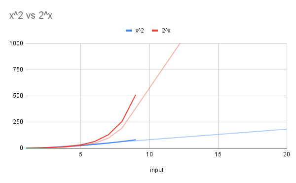

# Trabalho 4
***Implementação completa disponível no [Github](https://github.com/VitorHugoOli/tp_III_eda).***

## Pesquisa
To prove that the graph coloring problem is a NP problem, one can use the following steps:

1. First, show that the problem is in NP, meaning that there exists a polynomial-time algorithm that can verify a proposed solution to the problem. In the case of the graph coloring problem, a solution is a coloring of the vertices of the graph such that no two adjacent vertices have the same color. To verify a proposed solution, one can simply check that the coloring is valid by inspecting the colors of each vertex and its neighbors, which can be done in polynomial time.

2. Next, show that the problem is NP-hard, meaning that it is at least as difficult as any NP-complete problem. To do this, one can use a known NP-complete problem, such as the traveling salesperson problem, and reduce it to the graph coloring problem. This means that given an instance of the traveling salesperson problem, one can construct an instance of the graph coloring problem that is equivalent in terms of the difficulty of finding a solution. If this can be done, then the graph coloring problem is NP-hard.

3. Finally, since the problem is in NP and NP-hard, it is NP-complete. This means that it is a NP problem that is at least as difficult as any NP-complete problem, and no polynomial-time algorithm is known that can solve it optimally. However, it can be solved in exponential time by a NP algorithm.

By following these steps, one can prove that the graph coloring problem is a NP problem.


## Parte Um - Conjunto independente máximo

> Conjunto independente máximo (MIS) é um conjunto de vértices que não são adjacentes uns aos outros, o que significa que não há arestas entre eles. Isso significa que dois vértices no conjunto não compartilham uma aresta. Um conjunto independente máximo é considerado "máximo" porque não pode ser expandido sem quebrar a propriedade independente do conjunto (ou seja, adicionar quaisquer vértices adicionais faria com que pelo menos um par de vértices no conjunto compartilhasse uma aresta). Em outras palavras, um conjunto independente maximal é o maior conjunto possível de vértices em um grafo que não são adjacentes entre si.
>
> Este problema serve como modelos úteis para problemas de otimização do mundo real, por exemplo, descobrir componentes genéticos estáveis para projetar sistemas genéticos modificados.

_reference: https://en.wikipedia.org/wiki/Independent_set_(graph_theory)#:~:text=It%20is%20a%20strongly%20NP%2Dhard%20problem.%5B3%5D%20As%20such%2C%20it%20is%20unlikely%20that%20there%20exists%20an%20efficient%20algorithm%20for%20finding%20a%20maximum%20independent%20set%20of%20a%20graph._

### 1.1 - Prova de que o problema é NP

O problema do Conjunto Independente Máximo é um problema NP, pois podemos verificar se uma solução é válida em tempo polinomial. Para verificar se uma solução é válida, basta verificar se há cada vertice da solução, se há algum vertice adjacente a ele na solução. Se houver, a solução não é válida, caso contrário, é válida.

### 1.2 - Implementação não polinomial

Uma possível implementação não polinomial, seria a função abaixo está recebe um gráfico como um ponteiro para uma estrutura Graph e retorna um vetor de inteiros representando os vértices no conjunto independente máximo.

Primeiro, é verificado se o grafo não possui vértices ou apenas um vértice. Se qualquer um desses casos for verdadeiro, a função retornará uma vetor vazia ou uma vetor com um único vértice, respectivamente.

Em seguida, a função define o primeiro vértice do grafo `vCurrent` como ponto de partida para a busca do conjunto independente maximal. Ele também cria um novo gráfico `graph2` com os mesmos vértices e arestas do gráfico original, mas excluindo o primeiro vértice.

A função então chama a si mesma recursivamente no novo gráfico `graph2` para encontrar o conjunto independente máximo desse gráfico. Este conjunto de vértices é salvo na variável `res1`.

Em seguida, a função itera sobre as arestas de `vCurrent` e remove quaisquer vértices adjacentes a `vCurrent` (isto é, compartilham uma aresta com `vCurrent`) do novo gráfico `graph2`. Em seguida, chama a si mesmo recursivamente no gráfico modificado `graph2` para encontrar o conjunto independente máximo desse gráfico. Este conjunto de vértices é salvo na variável `res2`.

Finalmente, a função compara o cumprimento de `res1` e `res2` e retorna o conjunto com o maior número de vértices.

A complexidade desse algorítimo é $O(2^n)$


```go
func (g *Graph) graphSets() []int {
	if len(g.Vertices) == 0 {
		return []int{}
	}

	if len(g.Vertices) == 1 {
		return []int{g.Vertices[0]}
	}

	vCurrent := g.Vertices[0]

	graph2 := Graph{
		Vertices: make([]int, 0, len(g.Vertices)),
		Edges:    make(map[int][]int),
	}

	for i, v := range g.Vertices {
		if i == 0 {
			continue
		}
		graph2.Vertices = append(graph2.Vertices, v)
		graph2.Edges[v] = g.Edges[v]
	}

	res1 := graph2.graphSets()

	for _, v := range g.Edges[vCurrent] {
		// if v is in graph2.Vertices 
		for i, v2 := range graph2.Vertices {
			if v == v2 {
				graph2.Vertices = append(graph2.Vertices[:i], graph2.Vertices[i+1:]...)
				delete(graph2.Edges, v)
			}
		}
	}

	res2 := []int{vCurrent}
	res2 = append(res2, graph2.graphSets()...)

	if len(res1) > len(res2) {
		return res1
	}
	return res2
}

```
### 1.3 & 1.4 - Solução não determinística polinomial

A solução abaixo se utiliza do `OraculoMaxSubSet` para determinar um conjunto independente máximo. Em seguida, é verificado se o conjunto é independente, caso não seja, é retornado um array vazio. Caso Seja, o conjunto é retornado.

O algoritmo é polinomial, pois o OraculoMaxSubSet é O(1) e a verificação do conjunto é feita em O(V), resultando em uma complexidade de O(V).


```go
func (g *Graph) graphSetsNonDeterministic() []int {
	maxSubset := OraculoMaxSubSet(graph)
	//check if the maxSubset is a valid subset
	for i, v := range maxSubset {
		if i == len(maxSubset)-1 {
			break
		}
		for _, v2 := range g.Edges[v] {
			if v2 == maxSubset[i+1] {
				return []int{}
			}
		}
	}
	return maxSubset
}
```

### 1.5 - Comparando as soluções

A solução não polinomial, apesar de ser exata, não é escalável, pois a complexidade é $O(2^n)$, enquanto a solução não determinística polinomial é escalável, pois a complexidade é $O(V)$, onde V é o número de vértices do grafo. Conseguimos visualizar o crescimento de cada uma dessas soluções no gráfico abaixo que mostra a quantidade de comparações dado o número de entradas.



No gráfico acima a linha laranja representa o crescimento da função não polinomial e a azul não determinística, nota-se o quanto a não polinomial cresce para uma entrada relativamente pequena como 10 em que possui 10x mais comparações que o não determinístico.

